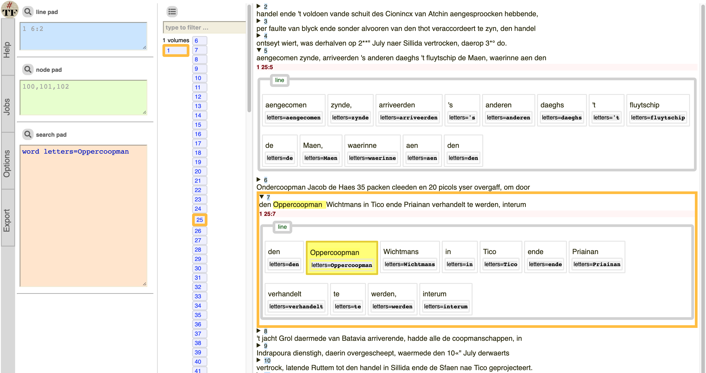

# Daghregister in Text-Fabric

## Source

Lodewijk Petram referred me to the Daghregister,
and gave me a
[link to archive.org](https://archive.org/details/daghregistergeh03kologoog/page/n6/mode/2up)
from where I have downloaded a volume, apparently as digitized by Google.

## Conversion

HOCR is simple HTML in which the results of an OCR process are stored:
text, bounding boxes, confidences.
All organized by page, area, paragraph, line, word and character.

This is a big file (180 MB) for a source that has 500 pages.

### Step 1: reduce

We reduced and simplified the HOCR to a TSV file (72 MB) with identical essential information.
The result is much easier viewable in the editor,
mainly because the syntax highlighting is not triggered,
which helps performance greatly.

### Step 2: wordify

We converted the character-based lines of information to word-based lines.
Some words that were split by a small space, have been joined again.
We averaged the character confidences to word confidences.

### Step 3: clean

We removed all frontmatter pages, plus all words "Digitized by Google".
Funnily enough, these strings were OCRed too, and sometimes not entirely
correctly. We still found them by using the Levenshtein edit distance.

Also the header lines were removed.

### Step 4: make text-fabric

We genereated straightforward text-fabric out of it, and decided to loose some of the
information. We do not use the area containers. We do not retain the bounding box information.

### Step 5: use text-fabric

If you have installed text-fabric (`pip install text-fabric`),
and if you have cloned this repository to `~/github/Dans-labs/clariah-dr`,
then you can give this command on the prompt:

``` sh
text-fabric Dans-labs/clariah-dr/tf/daghregister/001/0.1:clone --checkout=clone
```

after which your browser opens with an interface on this volume.
You can browse pages and execute queries.

For example, enter this in the search box and click the search icon:

```
word letters=Oppercoopman
```

That has 8 results, and you can see them in context.
Here is the one on page 25 line 7:



You can also use text-fabric in a jupyter notebook.

A tutorial will follow, but it is not unlike this one for the
[General Missives](https://nbviewer.org/github/annotation/tutorials/blob/master/missieven/start.ipynb).

